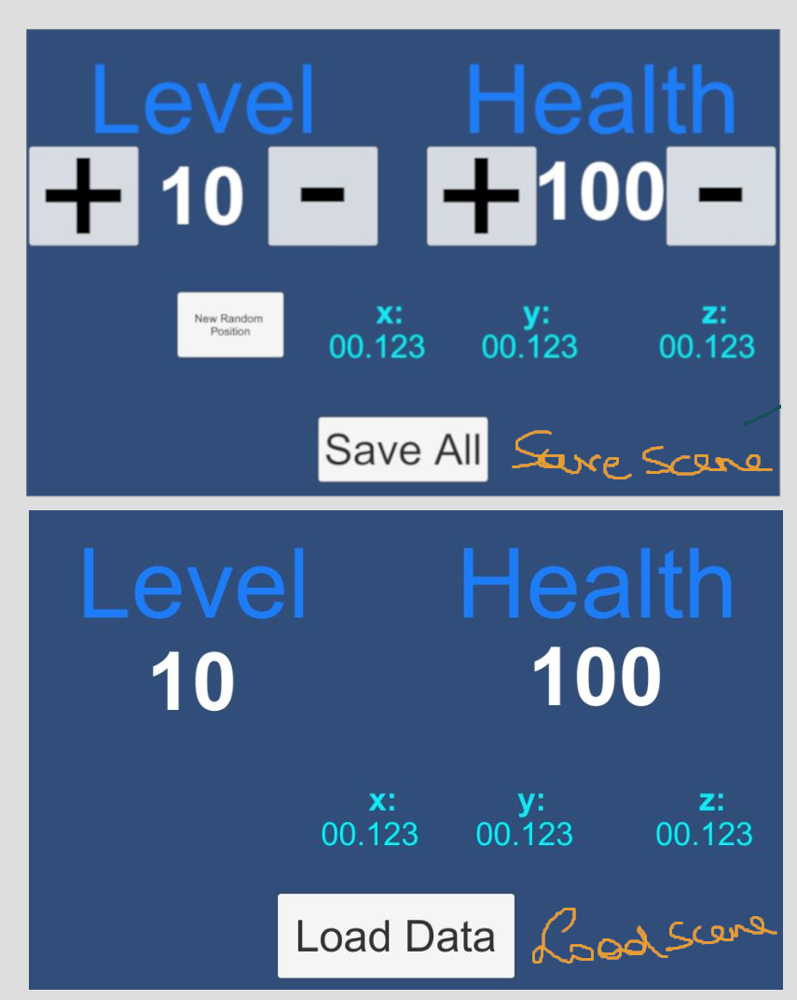

# smeerws-SaveLoadUnity

### Project description: 
Save and load persistent data from a file via serialization with the
Binary Formatter class.
This project contains two scenes, one to save data, one to load data.

Save scene: The int variables level and health can be modified by the user
by pressing + or -. Three float variables X,Y,Z (position) change by
pressing the button "New Random Position". The range for X,Y,Z is between
1 and 100; By pressing the "Save All" button, the data for health, level
and position will be saved in a binary format.

Load scene: It shows the variables health, level and position as loaded
from the saved binary file. If the file does not
exist, you will get an error ("File not found"). In this scene the only
interaction is to press the "Load Data" button.

### Development platform: 
Windows 10, Unity 2020.1.5f1, Visual Studio 2019

### Target platform: 
WebGL (Ref Res 960x600) 

### Visuals: 

### Necessary setup/execution steps: 
Installation process, e.g. step by step instructions that I can run the project after cloning it

### Third party material: 
Tutorial: https://youtu.be/XOjd_qU2Ido

### Project state: 
80%
open: catch exceptions, clean code;

### Limitations: 
Null Pointer Execption, if data not saved as a first step!!

### Lessons Learned: 
Binary Formatter, FileStream, Debug.LogError, Application.persistentDataPath

Copyright by smeerws
